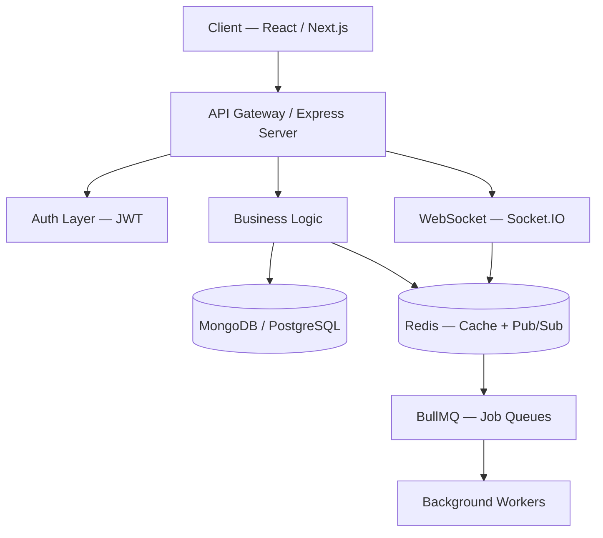

<div align="center">


<br/>

<p>
<a href="#about">ABOUT</a> &nbsp;·&nbsp;
<a href="#skills">SKILLS</a> &nbsp;·&nbsp;
<a href="#analytics">ANALYTICS</a> &nbsp;·&nbsp;
<a href="#experience">EXPERIENCE</a> &nbsp;·&nbsp;
<a href="#projects">PROJECTS</a> &nbsp;·&nbsp;
<a href="#architecture">ARCHITECTURE</a> &nbsp;·&nbsp;
<a href="#roadmap">ROADMAP</a> &nbsp;·&nbsp;
<a href="#contact">CONTACT</a>
</p>

<a href="https://rakeshchourasia-portfolio.vercel.app/"></a>
<a href="https://linkedin.com/in/rakesh-chourasia-3a4b3825b"></a>
<a href="https://github.com/Rakeshchourasia"></a>
<a href="mailto:rakesh.chourasia@example.com"></a>

<br/><br/>


</div>

<br/>


<h2 id="about">📌 SYSTEM BOOT &amp; ABOUT</h2>

```bash
$ ssh rakesh@devserver

[■■■■■■■■■■■■■■■■■■■■■■■■■■■■] 100%  boot sequence complete

> cat profile.json
{
  "name"      : "Rakesh Chourasia",
  "role"      : "Full Stack MERN Developer",
  "company"   : "Metconnect Infotech Pvt Ltd",
  "education" : "B.Tech — Computer Science Engineering",
  "location"  : "Patna, Bihar, India",
  "stack"     : ["React", "Next.js", "Node.js", "Express", "MongoDB", "PostgreSQL"],
  "realtime"  : ["Redis", "BullMQ", "Socket.IO"],
  "auth"      : "JWT",
  "infra"     : "Docker",
  "learning"  : ["System Design", "AI Integration", "Backend Architecture"],
  "mission"   : "ship systems that survive real traffic",
  "status"    : "system_online [OK]"
}

$ _
```

<table width="100%">
<tr>
<td width="62%" valign="top">

I'm a **Full Stack MERN Developer** at **Metconnect Infotech Pvt Ltd**, based in **Patna, Bihar, India**. I care about backend-heavy, production-grade systems — architecture that survives real traffic, not just features that demo well.

|  |  |
|---|---|
| 🔭 **Building** | Queue-driven backend services with a real-time layer |
| 🌱 **Learning** | System Design · AI Integration · Distributed Architecture |
| 🎯 **Core stack** | React · Next.js · Node.js · Express · MongoDB · PostgreSQL |
| ⚡ **Realtime** | Redis · BullMQ · Socket.IO |
| 🔐 **Auth** | JWT-based authentication systems |
| 🐳 **Infra** | Docker |
| 💬 **Ask me about** | Backend architecture, queues, real-time systems, MERN |

</td>
<td width="38%" valign="top">

<table width="100%">
<tr><td colspan="2" align="center"><b>🪪 DEVELOPER CARD</b></td></tr>
<tr><td><b>Name</b></td><td>Rakesh Chourasia</td></tr>
<tr><td><b>Role</b></td><td>MERN Developer</td></tr>
<tr><td><b>Company</b></td><td>Metconnect Infotech</td></tr>
<tr><td><b>Location</b></td><td>Patna, Bihar, IN</td></tr>
<tr><td><b>Focus</b></td><td>Backend &amp; System Design</td></tr>
<tr><td><b>Status</b></td><td>🟢 <code>AVAILABLE</code></td></tr>
</table>

<br/>

<br/>
<br/>


</td>
</tr>
</table>


<h2 id="skills">🛠️ SKILLS</h2>

<table width="100%">
<tr><td width="16%"><b>Frontend</b></td><td></td></tr>
<tr><td><b>Backend</b></td><td>
&nbsp;


</td></tr>
<tr><td><b>Database</b></td><td></td></tr>
<tr><td><b>DevOps &amp; Tools</b></td><td></td></tr>
<tr><td><b>Testing</b></td><td>


</td></tr>
<tr><td><b>AI</b></td><td>


</td></tr>
</table>

<div align="center">


</div>

<div align="center">

**⚡ TECH STACK**


</div>


<h2 id="analytics">📊 GITHUB ANALYTICS</h2>

<div align="center">


</div>

<details>
<summary><b>ℹ️ widget setup notes</b></summary>
<br/>

- **Contribution snake** requires a GitHub Action in a repo named exactly `Rakeshchourasia` (see <a href="https://github.com/Platane/snk">Platane/snk</a>) to generate the SVG this points to.
- Stats / streak / trophy widgets refresh automatically — no setup needed.

</details>


<h2 id="experience">💼 EXPERIENCE &amp; EDUCATION</h2>

<table width="100%">
<tr><th align="left">Period</th><th align="left">Role</th><th align="left">Organization</th><th align="left">Highlights</th></tr>
<tr>
<td valign="top">🟢 <b>Present</b></td>
<td valign="top">Full Stack MERN Developer</td>
<td valign="top">Metconnect Infotech Pvt Ltd</td>
<td valign="top">Backend architecture · real-time systems (Socket.IO + Redis) · queue processing (BullMQ) · JWT auth · Docker</td>
</tr>
<tr>
<td valign="top">🎓</td>
<td valign="top">B.Tech, Computer Science Engineering</td>
<td valign="top">—</td>
<td valign="top">Strong foundation in Data Structures, Algorithms &amp; Systems</td>
</tr>
</table>


<h2 id="projects">🚀 FEATURED PROJECTS</h2>

<table width="100%">
<tr>
<td width="50%" valign="top">

> ### 🤖 Prompt Optimizer
> **AI Prompt Management Platform**
>
> ⚡ Rich markdown editor for prompt authoring
> ⚡ AI-assisted prompt refinement
> ⚡ Version control for prompt history
> ⚡ Smart search &amp; custom collections
>
> `React` `Node.js` `MongoDB`
> · 🟢 **Active Development**
>
> [**View Code →**](https://github.com/Rakeshchourasia)

</td>
<td width="50%" valign="top">

> ### 🏢 HR Management System
> **Enterprise Workforce Platform**
>
> ⚡ Employee lifecycle management
> ⚡ Attendance &amp; leave tracking
> ⚡ Role-based access control
> ⚡ Admin analytics dashboard
>
> `React` `Express` `MongoDB`
> · 🟢 **Production**
>
> [**View Code →**](https://github.com/Rakeshchourasia)

</td>
</tr>
<tr>
<td width="50%" valign="top">

> ### 🌾 Brilliant Bihar
> **Regional Digital Platform**
>
> ⚡ Content management system
> ⚡ Regional data aggregation
> ⚡ Responsive, SEO-optimized portal
>
> `Next.js` `Node.js` `PostgreSQL`
> · 🟢 **Live**
>
> [**View Code →**](https://github.com/Rakeshchourasia)

</td>
<td width="50%" valign="top">

> ### 🏘️ Property Listing Portal
> **Real Estate Marketplace**
>
> ⚡ Advanced property search &amp; filters
> ⚡ Image galleries and virtual tours
> ⚡ Owner/agent dashboards
> ⚡ Geo-location based filtering
>
> `React` `Express` `MongoDB`
> · 🟢 **Production**
>
> [**View Code →**](https://github.com/Rakeshchourasia)

</td>
</tr>
<tr>
<td width="50%" valign="top">

> ### 💬 Real-Time Chat Application
> **Live Messaging Platform**
>
> ⚡ Socket.IO powered messaging
> ⚡ Redis pub/sub for horizontal scaling
> ⚡ Typing indicators &amp; online presence
> ⚡ JWT-secured chat rooms
>
> `React` `Socket.IO` `Redis`
> · 🟢 **Active Development**
>
> [**View Code →**](https://github.com/Rakeshchourasia)

</td>
<td width="50%" valign="top">

> ### 📊 Zomato Sales Analysis
> **Data Analytics Dashboard**
>
> ⚡ Sales trend visualization
> ⚡ Regional performance breakdown
> ⚡ Interactive charts &amp; filters
> ⚡ Data cleaning pipeline
>
> `React` `Node.js` `PostgreSQL`
> · 🟢 **Completed**
>
> [**View Code →**](https://github.com/Rakeshchourasia)

</td>
</tr>
<tr>
<td width="50%" valign="top">

> ### 🗺️ Land Portal
> **Land Records &amp; Listings Platform**
>
> ⚡ Land record digitization
> ⚡ Map-based plot visualization
> ⚡ Document upload &amp; verification
> ⚡ Admin approval workflow
>
> `Next.js` `Express` `MongoDB`
> · 🟢 **Production**
>
> [**View Code →**](https://github.com/Rakeshchourasia)

</td>
<td width="50%" valign="top">

> ### 🌐 Portfolio Website
> **Personal Developer Showcase**
>
> ⚡ Interactive project showcase
> ⚡ Smooth scroll animations
> ⚡ Fully responsive design
> ⚡ Optimized for performance on Vercel
>
> `Next.js` `React` `Tailwind`
> · 🟢 **Live**
>
> [**Live Demo →**](https://rakeshchourasia-portfolio.vercel.app/) · [**View Code →**](https://github.com/Rakeshchourasia)

</td>
</tr>
</table>


<h2>🌍 OPEN SOURCE, ORGANIZATIONS &amp; CREDENTIALS</h2>

<table width="100%">
<tr>
<td width="33%" valign="top">

**🤝 Open Source**

Exploring contributions to MERN-stack tooling, focused on backend utilities and queue systems, with clean commits and meaningful PRs.

</td>
<td width="33%" valign="top">

**🏢 Organizations**

Metconnect Infotech Pvt Ltd
Full Stack MERN Developer

</td>
<td width="33%" valign="top">

**📜 Certifications**

B.Tech, Computer Science Engineering
Full Stack Web Development (MERN)
Backend Architecture &amp; System Design

</td>
</tr>
</table>

<details>
<summary><b>🏆 Achievements</b></summary>
<br/>

- Delivered multiple production-grade MERN applications end-to-end
- Designed real-time systems handling concurrent socket connections
- Built queue-driven backend architecture with BullMQ &amp; Redis
- Architected secure authentication flows using JWT

</details>


<h2 id="roadmap">🗺️ LEARNING ROADMAP</h2>

<div align="center">

</div>

<div align="center">


</div>


<h2 id="architecture">🏗️ BACKEND ARCHITECTURE &amp; SYSTEM DESIGN</h2>



Focused on **modular, queue-driven, horizontally scalable** backend systems — separating request/response logic from background processing, using Redis as the backbone for caching, pub/sub messaging, and job queues via BullMQ.

**Core focus areas:** load balancing across Node.js clusters · cache-aside strategies with Redis · async job processing with BullMQ · query and index optimization on MongoDB/PostgreSQL · rate limiting and JWT auth at the gateway layer · designing for horizontal scale from day one.

<h2>🤖 AI PROJECTS &amp; CURRENT FOCUS</h2>

**Prompt Optimizer** — AI-assisted prompt refinement and version control for structured prompt engineering.

Exploring practical **AI integration** in production applications — embedding AI-assisted workflows into full-stack products rather than treating AI as a side experiment.

<details>
<summary><b>🎲 A few things I obsess over</b></summary>
<br/>

- I think in terms of queues, not just functions
- Redis is basically my second brain
- System design diagrams live rent-free in my head
- I ship features, but I obsess over architecture

</details>


<h2>💭 QUOTE</h2>

<div align="center">

</div>

<h2>☕ SUPPORT</h2>

<div align="center">
<a href="https://www.buymeacoffee.com/"></a>
</div>


<h2 id="contact">🤝 CONNECT</h2>

<div align="center">

<a href="https://rakeshchourasia-portfolio.vercel.app/"></a>
<a href="https://linkedin.com/in/rakesh-chourasia-3a4b3825b"></a>
<a href="https://github.com/Rakeshchourasia"></a>

If you're building something in **MERN**, **backend systems**, or **AI integration** — let's talk.

</div>


<div align="center">
<sub>Rakesh Chourasia · Patna, Bihar, India</sub>
</div>
